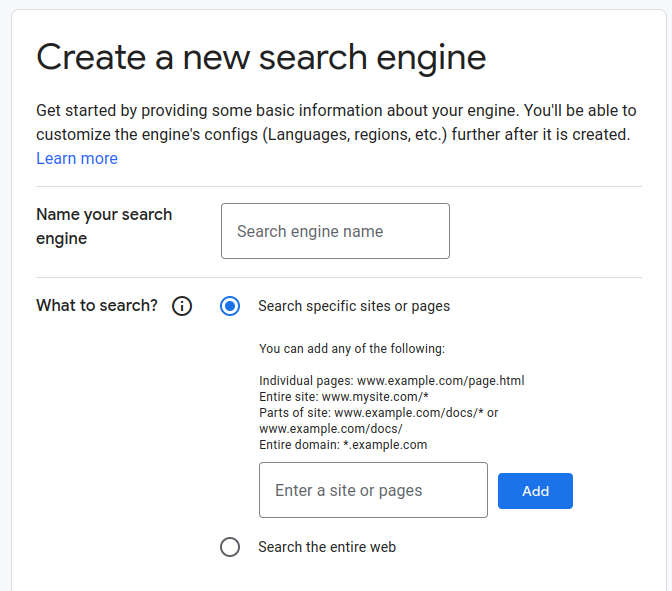

# Book Link

## Installation

```
npm i book-link
```

## Example

Find pdf links of a book

```
import { BookLink } from "book-link";

const API_KEY = YOUR_API_KEY;
const CONTEXT_KEY = YOUR_CONTEXT_KEY;
const result = await BookLink.linkArray("Pride and Prejudice", API_KEY, CONTEXT_KEY);
console.log(result);
```

Console of the previous search

```
[
  'https://www.gutenberg.org/files/1342/old/pandp12p.pdf',
  'https://giove.isti.cnr.it/demo/eread/Libri/joy/Pride.pdf',
  'https://archive.org/download/prideprejudice00aust/prideprejudice00aust.pdf',
  'https://www.tarakeswardegreecollege.org/res/class/080-pride-and-prejudice.pdf',
  'https://www.ucm.es/data/cont/docs/119-2014-04-09-Guide%20To%20Pride%20and%20Prejudice.pdf',
  'https://almabooks.com/wp-content/uploads/2016/10/Excerpt_Pride_and_Prejudice.pdf',
  'https://gibbssmithcovers.com/Pride-Prejudice-eBLAD.pdf',
  'https://ir.nbu.ac.in/bitstream/123456789/1169/6/06_chapter_02.pdf',
  'https://pdfs.semanticscholar.org/9813/456c78ee744bee3b882005b0387960ad7769.pdf',
  'https://core.ac.uk/download/pdf/230746955.pdf'
]
```

## Keys

To get **Google API Key** for Programmable Search Engine,
goto: https://developers.google.com/custom-search/v1/introduction#identify_your_application_to_google_with_api_key


To get **Search Engine Key**,
goto : https://programmablesearchengine.google.com/controlpanel/create


